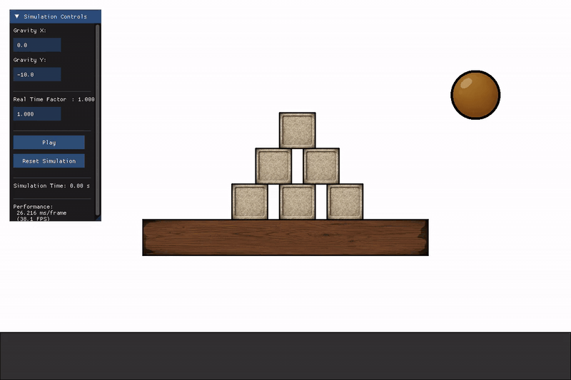
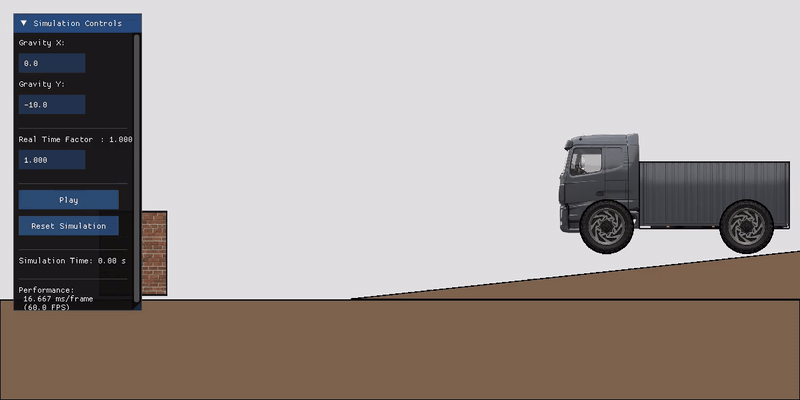

# Fx2D — 2D Rigid Body Physics Engine

A 2D rigid body physics engine written in C++20, using SAT collision detection, XPBD constraint solving, and raylib for rendering.

#### [Examples](./examples/)


## Key Features
- **SAT collision detection:** Efficient circle and polygon collision using the Separating Axis Theorem (SAT)
- **XPBD constraint solver:** Position-based dynamics with compliance control
- **Modern memory management:** Safe resource handling with `std::shared_ptr` / `std::unique_ptr`
- **YAML based scene description:** Declarative setup of entities, textures, and physics parameters in `.yml` files
- **FxArray & Math Utilities**: NumPy-style `FxArray` and comprehensive linear-algebra utilities in Fx2D/Math.h
- **raylib-based rendering:** Lightweight, cross-platform renderer with raylib and ImGui integration


## Dependencies

- **CMake** 3.16+ - Build system generator
- **Eigen3** 3.3+ - Linear algebra and math operations
- **raylib** 4.5+ - Scene rendering and graphics
- **yaml-cpp** - YAML parsing for scene configuration
- **ImGui** 1.92 - User interface framework
- **rlImGui** - Raylib-ImGui integration

## Installation & Build

The repository keeps `lib/imgui` and `lib/rlImGui` as placeholder folders in Git, but it does not commit the third-party sources. Populate those folders locally before building.

### Method 1: CMake

```bash
cmake -S . -B build -DCMAKE_BUILD_TYPE=Release
cmake --build build -j
```

### Method 2: Using fxmake

```bash
chmod +x fxmake       # Make executable
./fxmake              # Build in Release mode
./fxmake debug        # Build in Debug mode
./fxmake rebuild      # Clean and rebuild
./fxmake clean        # Clean build artifacts
```

## Getting Started

### Basic Usage
```cpp
#include "Fx2D/Core.h"

int main() {
    // Load scene from YAML
    auto scene = FxYAML::buildScene("./Scene.yml");

    // Initialize renderer with 60 FPS target
    FxRylbRenderer renderer(scene, 60);
    
    // Start the simulation loop
    renderer.run();
    return 0;
}
```

For headless simulation, testing, or data collection.
```cpp
int main() {
    // Load scene from YAML
    auto scene = FxYAML::buildScene("./Scene.yml");

    const double dt = 0.001f;             // Fixed time step in seconds
    auto ball = scene.get_entity("ball"); // Get the poiner to the entity by name "ball"
    for (size_t i = 0; i < 10; ++i) {
        scene.step(dt); // Advance physics without rendering
        std::cout<< ball->pose <<std::endl;  
    }
    return 0;
}
```

### Running Examples

To run an example, copy the `main.cpp` from [examples](./examples/) to `src/`, build the project, and ensure `Scene.yml` and assets are accessible to the executable.

```bash
./Fx2D      # Linux/macOS
./Fx2D.exe  # Windows
```



**Available examples:** [stacked_boxes](./examples/stacked_boxes/) · [truck](./examples/truck/) · [joint_control_demo](./examples/joint_control_demo/) — revolute and prismatic joint motor control (position, velocity, and effort modes)

## Documentation

| Doc | Description |
|---|---|
| [scene_yml.md](./docs/scene_yml.md) | Full reference for writing `Scene.yml` files — scene block, entities, geometry types, physics fields |
| [xpbd_solver.md](./docs/xpbd_solver.md) | How the XPBD solver works — per-substep pipeline, constraint kernel equations, constraint types |
| [collision_resolution.md](./docs/collision_resolution.md) | Collision detection and response — SAT narrow phase, penetration correction, restitution & friction |
| [raylib_renderer.md](./docs/raylib_renderer.md) | Raylib renderer API — window setup, background, camera, draw callbacks |
| [headless_mode.md](./docs/headless_mode.md) | Running the simulation without a renderer for testing and data collection |
| [joint_control.md](./docs/joint_control.md) | Joint motor API — revolute and prismatic joints, control modes (position/velocity/effort), PID tuning |
| [math_utils.md](./docs/math_utils.md) | `FxArray`, vector/matrix math utilities, and helper functions |

## License

BSD-3-Clause License

## Contributing

Contributions are welcome! Please follow the existing code style and conventions.

- **Bugs & feature requests:** Open a new issue describing the problem or proposal clearly (steps to reproduce, or the rationale/use case).
- **Working on features/fixes:** Create a new branch from `main`, commit your changes, and open a pull request referencing the issue.
