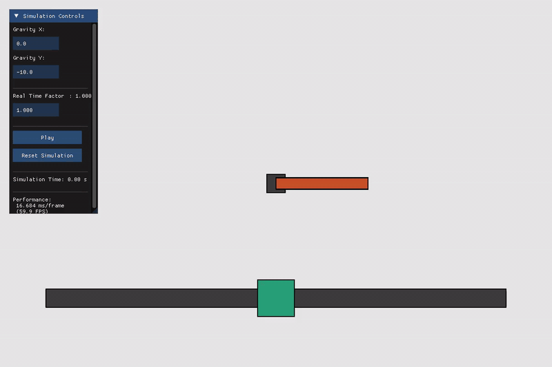

# Fx2D — 2D Rigid Body Physics Engine

A 2D rigid body physics engine written in C++20, using SAT collision detection, XPBD constraint solving, and raylib for rendering.

#### [Examples](./examples/)


## Key Features
- **Unified shape model:** Circles, capsules, edges, chains (open polylines for level geometry), polygons, and rounded (skin-radius) rectangles and polygons, all stored as `vertices[] + skin_radius` and handled by one skin-aware SAT narrow phase
- **Dynamic AABB broad phase:** SAH-guided dynamic AABB tree with fat boxes and dual-tree pair descent
- **Continuous collision:** Opt-in speculative contacts (`ccd: true`) that anticipate impacts to curb tunneling for fast bodies
- **XPBD constraint solver:** Substepped position-based dynamics with compliance control, warm starting, and Coulomb friction
- **Joints with motors:** Revolute and prismatic joints with position / velocity / effort control modes and PID tuning
- **Spatial queries:** Ray casts, overlap and point queries sharing the simulation's own narrow phase, for line of sight, area effects, click-picking and RL observations
- **Entity groups:** Named sets managed as one thing — bulk delete/enable, restored by reset, and intra-group collision filtering via one integer per body
- **Contacts, events, and sensors:** Buffered contacts after each step, begin/end contact events, and trigger-only sensor entities
- **Keyboard and mouse input:** Renderer-agnostic input for gameplay code, with world-space cursor position and headless injection for scripted or agent-driven scenes
- **Sleeping:** Resting bodies fall asleep and stop consuming solver time until disturbed
- **YAML based scene description:** Declarative setup of entities, textures, and physics parameters in `.yml` files
- **Headless mode:** Build and run the physics core with no renderer, for testing, CI, and data collection
- **FxArray & Math Utilities**: NumPy-style `FxArray` and comprehensive linear-algebra utilities in Fx2D/Math.h
- **raylib-based rendering:** Lightweight, cross-platform renderer with raylib and ImGui integration


## Dependencies

- **CMake** 3.16+ - Build system generator
- **Eigen3** 3.3+ - Linear algebra and math operations
- **raylib** 4.5+ - Scene rendering and graphics
- **yaml-cpp** - YAML parsing for scene configuration
- **ImGui** 1.92 - User interface framework
- **rlImGui** - Raylib-ImGui integration

## Installation & Build

The repository keeps `lib/imgui` and `lib/rlImGui` as placeholder folders in Git, but it does not commit the third-party sources. Populate those folders locally before building.

### Method 1: CMake

```bash
cmake -S . -B build -DCMAKE_BUILD_TYPE=Release
cmake --build build -j
```

### Method 2: Using fxmake

```bash
chmod +x fxmake       # Make executable
./fxmake              # Build in Release mode
./fxmake debug        # Build in Debug mode
./fxmake rebuild      # Clean and rebuild
./fxmake clean        # Clean build artifacts
```

## Getting Started

### Basic Usage
```cpp
#include "Fx2D/Core.h"

int main() {
    // Load scene from YAML
    auto scene = FxYAML::buildScene("./Scene.yml");

    // Initialize renderer with 60 FPS target
    FxRylbRenderer renderer(scene, 60);
    
    // Start the simulation loop
    renderer.run();
    return 0;
}
```

For headless simulation, testing, or data collection. Include `Fx2D/Physics.h` instead of `Fx2D/Core.h` — it pulls in no raylib, Dear ImGui or rlImGui headers, so no graphics stack is needed at all.
```cpp
#include "Fx2D/Physics.h"

int main() {
    // Load scene from YAML
    auto scene = FxYAML::buildScene("./Scene.yml");

    const double dt = 0.001f;             // Fixed time step in seconds
    auto ball = scene.get_entity("ball"); // Get the poiner to the entity by name "ball"
    for (size_t i = 0; i < 10; ++i) {
        scene.step(dt); // Advance physics without rendering
        std::cout<< ball->pose <<std::endl;  
    }
    return 0;
}
```

### Running Examples

Build the visual examples from the repo root (textures live next to each example under `examples/*/assets/`):

```bash
cmake -S . -B build -DCMAKE_BUILD_TYPE=Release -DFX2D_BUILD_EXAMPLES=ON
cmake --build build -j --target example_truck example_stacked_boxes example_joint_control
# run from the repo root so Scene.yml texture paths resolve
./build/example_stacked_boxes
./build/example_truck
./build/example_joint_control
```

Headless examples skip the graphics stack entirely:

```bash
./scripts/build_headless.sh
./build-headless/truck_headless        # run from the repo root
./build-headless/joint_control_demo
```




**Available examples:** [stacked_boxes](./examples/stacked_boxes/) · [truck](./examples/truck/) · [joint_control_demo](./examples/joint_control_demo/) — revolute and prismatic joint motor control (position, velocity, and effort modes) · [angry_boxes](./examples/angry_boxes/) — mouse-driven slingshot: drag the ball back, release, topple the tower · [chain_terrain](./examples/chain_terrain/) — chain collider terrain: click to drop balls and watch them settle

## Documentation

| Doc | Description |
|---|---|
| [scene_yml.md](./docs/scene_yml.md) | Full reference for writing `Scene.yml` files — scene block, entities, geometry types, physics fields |
| [xpbd_solver.md](./docs/xpbd_solver.md) | How the XPBD solver works — per-substep pipeline, constraint kernel equations, constraint types |
| [collision_resolution.md](./docs/collision_resolution.md) | Collision detection and response — SAT narrow phase, penetration correction, restitution & friction |
| [contacts_and_events.md](./docs/contacts_and_events.md) | Reading contacts after a step, begin/end contact events, and sensor (trigger) entities |
| [queries.md](./docs/queries.md) | Ray casts, overlap and point queries — line of sight, lidar fans, explosions, click-picking |
| [simd_plan.md](./docs/simd_plan.md) | The plan of record for vectorizing the solver — SoA gather/scatter, bulk loops, colored 8-wide velocity solve |
| [entity_groups.md](./docs/entity_groups.md) | Named entity sets — bulk operations, intra-group collision filtering, reset semantics, naming |
| [input.md](./docs/input.md) | Keyboard and mouse input for gameplay — renderer polling, world-space cursor, headless injection |
| [raylib_renderer.md](./docs/raylib_renderer.md) | Raylib renderer API — window setup, background, camera, draw callbacks |
| [headless_mode.md](./docs/headless_mode.md) | Running the simulation without a renderer for testing and data collection |
| [joint_control.md](./docs/joint_control.md) | Joint motor API — revolute and prismatic joints, control modes (position/velocity/effort), PID tuning |
| [math_utils.md](./docs/math_utils.md) | `FxArray`, vector/matrix math utilities, and helper functions |

## Contributing

Contributions are welcome — see [CONTRIBUTING.md](./docs/CONTRIBUTING.md) for the
workflow, lint gate (`./scripts/lint.sh`), and how to run the test suite.

## License

BSD-3-Clause License
