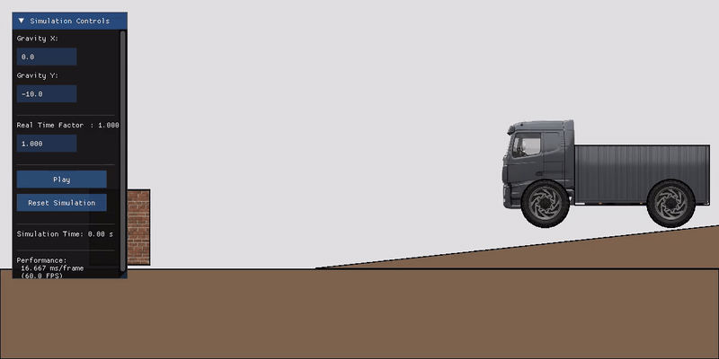
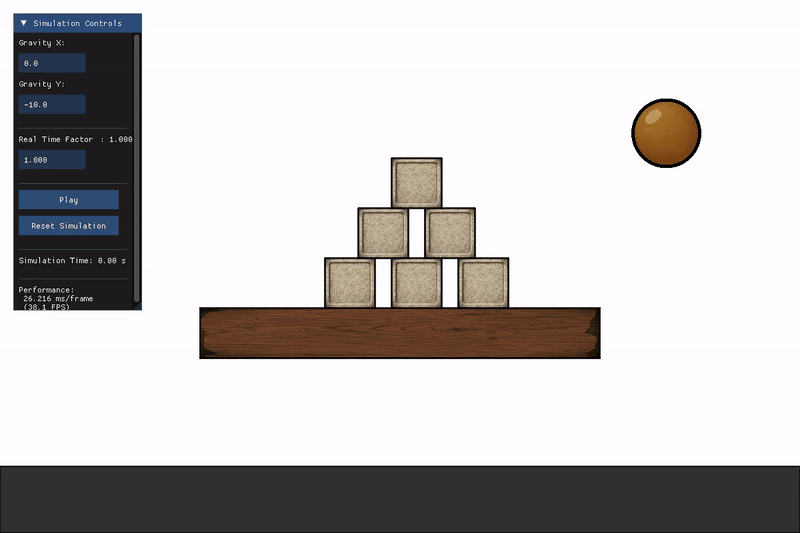
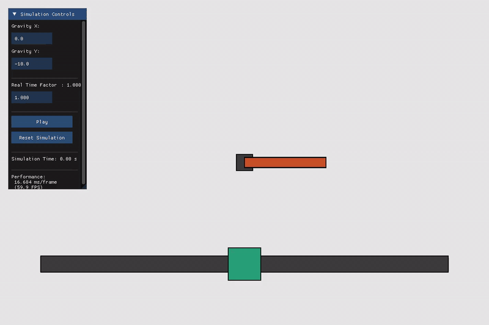

<div align="center">

<h1>
  <picture>
    <source media="(prefers-color-scheme: dark)" srcset="./docs/public/brand/fx2d-logo-dark.svg">
    
  </picture>
</h1>

**A fast, deterministic 2D rigid-body physics engine in C++20.**
SAT collision detection · XPBD constraint solver · joints with motors · YAML scenes · headless mode for simulation, testing and reinforcement learning.

[](https://bharath2.github.io/fx2d-physics-engine/)
[](https://en.cppreference.com/w/cpp/20)
[](./LICENSE)
[](https://github.com/Bharath2/fx2d-physics-engine/stargazers)

[**Get started**](https://bharath2.github.io/fx2d-physics-engine/getting-started/install) ·
[**Demos**](https://bharath2.github.io/fx2d-physics-engine/demos) ·
[**API reference**](https://bharath2.github.io/fx2d-physics-engine/api/) ·
[**Try it in your browser**](https://bharath2.github.io/fx2d-physics-engine/playground) 


<sub>`examples/angry_boxes` — drag the ball, release, topple the tower. Mouse input, contact impulses and a draw overlay in ~150 lines.</sub>

</div>

---

## Why Fx2D?

- **Physics you can read.** One explicit pipeline, from broad phase to SAT contacts to a substepped XPBD solver, with [solver](https://bharath2.github.io/fx2d-physics-engine/concepts/xpbd) and [collision](https://bharath2.github.io/fx2d-physics-engine/concepts/collisions) docs that derive the equations the code implements.
- **Built for simulation, not just games.** The headless build steps thousands of times per second with no window or GPU, for tests, batch rollouts and reinforcement learning.
- **Deterministic and tested.** Fixed timestep and solver order, adversarial stress scenes, and golden regression tests that keep speedups from changing the physics.
- **Small and embeddable.** About 8k lines of C++20 in one static library under BSD-3-Clause. Headless builds need only Eigen and yaml-cpp.

## Features

| Area | What you get |
|---|---|
| **Shapes** | Circles, capsules, edges, chains for terrain, and convex or rounded polygons |
| **Collision** | Dynamic AABB tree, SAT contacts with clipped manifolds, opt-in speculative CCD |
| **Solver** | Substepped XPBD with friction, restitution, warm starting, sleeping and a vectorised contact solve |
| **Joints** | Revolute and prismatic joints with PID motors, plus a mouse joint for click-and-drag |
| **Queries & events** | Ray casts, overlap and point queries, begin/end contact events and sensors |
| **Scenes** | YAML scenes with textures and joints, entity groups, collision filtering and one-call reset |
| **Viewer & input** | raylib viewer with an ImGui inspector; keyboard and mouse input that also works headless |
| **Platforms** | x86-64 and ARM64, tested with GCC, Clang, Apple Clang and MSVC |

## Quick start

```bash
git clone https://github.com/Bharath2/fx2d-physics-engine.git
cd fx2d-physics-engine
./scripts/build_headless.sh          # needs only Eigen3, yaml-cpp and TBB
./build-headless/fx2d_tests          # run the test suite
./build-headless/truck_headless      # step a scene with no window
```

Then write a scene and step it:

```yaml
# Scene.yml
scene:
  size: [16, 9]
  gravity: [0, -9.81]

entities:
  floor:
    pose: [8, 0.5, 0]
    physics: { mass: 0, gravity_scale: 0 }
    collision: { geometry: { rectangle: [16, 1] } }

  ball:
    pose: [8, 7, 0]
    physics: { mass: 1.0, elasticity: 0.5 }
    collision: { geometry: { circle: 0.25 } }
```

```cpp
#include "Fx2D/Scene.h"
#include "Fx2D/YamlUtils.h"

int main() {
    auto scene = FxYAML::buildScene("Scene.yml");
    auto ball  = scene.get_entity("ball");
    for (int i = 0; i < 600; ++i) {
        scene.step(1.0 / 60.0);          // fixed timestep, deterministic
        std::cout << ball->pose << '\n'; // x, y, theta
    }
}
```

Want a window? Include `Fx2D/Core.h` instead and hand the scene to the renderer:

```cpp
#include "Fx2D/Core.h"

int main() {
    auto scene = FxYAML::buildScene("Scene.yml");
    FxRylbRenderer renderer(scene, 60);
    renderer.run();
}
```

The [installation guide](https://bharath2.github.io/fx2d-physics-engine/getting-started/install) covers the visual build (raylib, Dear ImGui, rlImGui) on Linux, macOS, Windows and MSYS2.

## Examples

Every example is a plain C++ file plus a `Scene.yml` under [`examples/`](./examples/). Build them with `-DFX2D_BUILD_EXAMPLES=ON` and run from the repository root so asset paths resolve.

<table>
  <tr>
    <td align="center" width="50%">
      <a href="./examples/playground/"></a><br />
      <b><a href="./examples/playground/">Playground</a></b><br />
      <sub>Mouse joint drag, spawn shapes, seesaw, chain ramp. Also runs in the browser</sub>
    </td>
    <td align="center" width="50%">
      <a href="./examples/angry_boxes/"></a><br />
      <b><a href="./examples/angry_boxes/">Angry boxes</a></b><br />
      <sub>Mouse slingshot, trajectory preview, contact impulses, reset</sub>
    </td>
  </tr>
  <tr>
    <td align="center" width="50%">
      <a href="./examples/truck/"></a><br />
      <b><a href="./examples/truck/">Truck</a></b><br />
      <sub>Wheels, suspension joints, textured bodies</sub>
    </td>
    <td align="center" width="50%">
      <a href="./examples/stacked_boxes/"></a><br />
      <b><a href="./examples/stacked_boxes/">Stacked boxes</a></b><br />
      <sub>Resting stability, friction, textured shapes</sub>
    </td>
  </tr>
  <tr>
    <td align="center" width="50%">
      <a href="./examples/joint_control_demo/"></a><br />
      <b><a href="./examples/joint_control_demo/">Joint control</a></b><br />
      <sub>Revolute and prismatic motors: position, velocity, effort modes</sub>
    </td>
    <td align="center" width="50%">
      <a href="./examples/chain_terrain/"></a><br />
      <b><a href="./examples/chain_terrain/">Chain terrain</a></b><br />
      <sub>Polyline terrain, click-to-spawn, one-sided chain contacts</sub>
    </td>
  </tr>
  <tr>
    <td align="center" width="50%">
      <a href="./examples/bucket_fill/"></a><br />
      <b><a href="./examples/bucket_fill/">Bucket fill</a></b><br />
      <sub>Hundreds of bodies piling into a container, sleeping, broad phase under load</sub>
    </td>
    <td width="50%"></td>
  </tr>
</table>

```bash
cmake -S . -B build -DCMAKE_BUILD_TYPE=Release -DFX2D_BUILD_EXAMPLES=ON
cmake --build build -j
./build/example_playground       # also: example_angry_boxes, example_truck, example_stacked_boxes,
                                 # example_joint_control, example_chain_terrain, example_bucket_fill
```

## Headless simulation and reinforcement learning

The physics core has no dependency on the renderer. Build with `-DFX2D_HEADLESS=ON` (or `./scripts/build_headless.sh`) and you get the same engine with no raylib, no Dear ImGui and no window, which is what CI runs.

```cpp
FxScene scene = FxYAML::buildScene("examples/angry_boxes/Scene.yml");

// Drive the scene the way a player would, without a cursor.
scene.input().set_mouse_position(world_xy, screen_xy);
scene.input().set_mouse_button(FxMouseButton::Left, true);
scene.step(dt);

// Observe: contacts, impulses, ray casts, overlaps.
for (const auto& c : scene.contacts()) { /* c.entity1, c.normal, c.jn_accumulated */ }
FxRayHit hit;
if (scene.raycast(origin, direction, max_distance, hit)) { /* hit.entity, hit.point */ }
scene.reset();  // back to the authored scene, groups included
```

Because stepping is deterministic and single-threaded, many independent scenes can run in parallel across processes or threads for batched rollouts. See the [headless guide](https://bharath2.github.io/fx2d-physics-engine/guides/headless), [input](https://bharath2.github.io/fx2d-physics-engine/guides/input), [queries](https://bharath2.github.io/fx2d-physics-engine/guides/queries) and [contacts and sensors](https://bharath2.github.io/fx2d-physics-engine/guides/events).

## How it works

```
        step(dt)
          │
          └─ for each substep (default 14):
                ├─ joint motor controls, then integrate (gravity, forces, damping)
                ├─ broad phase ── dynamic AABB tree → candidate pairs (walked only if a proxy moved)
                ├─ narrow phase ── skin-aware SAT → contact manifolds (cached, warm-started)
                ├─ XPBD position solve ── penetration, joints, compliance
                ├─ derive velocities from the position change
                └─ velocity passes (default 4) ── restitution and Coulomb friction, colour-batched
```

Read the derivations in [XPBD solver](./docs/concepts/xpbd.md) and [collision pipeline](./docs/concepts/collisions.md), and the reasoning behind the defaults in the [roadmap](./docs/roadmap.md), which records every measurement that shaped the engine.

## Dependencies

| Dependency | Needed for | Version |
|---|---|---|
| [CMake](https://cmake.org/) | Build | 3.16+ |
| [Eigen3](https://eigen.tuxfamily.org/) | Math | 3.3+ |
| [yaml-cpp](https://github.com/jbeder/yaml-cpp) | Scene files | any recent |
| [raylib](https://www.raylib.com/) | Renderer only | 4.5+ |
| [Dear ImGui](https://github.com/ocornut/imgui) + [rlImGui](https://github.com/raylib-extras/rlImGui) | Renderer only | ImGui 1.92 |

The repository keeps `lib/imgui` and `lib/rlImGui` as empty placeholders; clone the upstream sources into them before a visual build. Headless builds need none of the renderer dependencies.

### Build

```bash
# CMake
cmake -S . -B build -DCMAKE_BUILD_TYPE=Release
cmake --build build -j

# or the helper
./fxmake            # Release
./fxmake debug      # Debug
./fxmake rebuild    # clean + rebuild
```

## Documentation

| Doc | Description |
|---|---|
| [Documentation site](https://bharath2.github.io/fx2d-physics-engine/) | Guided introduction, runnable demos, and full API reference |
| [Scene YAML](./docs/reference/scene-yaml.md) | Scene blocks, entities, geometry types, joints and physics fields |
| [XPBD solver](./docs/concepts/xpbd.md) | Per-substep pipeline, constraint kernel equations, and constraint types |
| [Collision pipeline](./docs/concepts/collisions.md) | SAT narrow phase, penetration correction, restitution, and friction |
| [Guides](./docs/guides/index.md) | Headless simulation, input, queries, contacts, groups, renderer, and joints |
| [Math utilities](./docs/reference/math.md) | `FxArray`, vector/matrix types, and helper functions |
| [Roadmap](./docs/roadmap.md) | What is next, with the measurements behind each decision |
| [Next steps](./docs/next_steps.md) | Session handoff: where the step time goes now, and what to pick up next |

## Roadmap highlights

Delivered most recently: the mouse joint, the browser playground, and a performance rework (a broad phase that skips unchanged trees, allocation-free hot paths, and the colour-batched SIMD contact solve from the [SIMD plan](./docs/roadmap/simd.md)) worth 2.2-8.1x per step.

- **Ropes and bridges**: distance joints and a dynamic chain mode.
- **Time-of-impact CCD** so fast bodies never tunnel through chains and edges.
- **More joints**: weld, wheel, pulley, gear.

## Contributing

Contributions are welcome. See [CONTRIBUTING](./docs/contributing.md) for the workflow, the lint gate (`./scripts/lint.sh`) and how to run the test suite. Open roadmap items each record the motivation, the relevant code paths and a suggested approach, so they make good first issues.

If Fx2D is useful to you, a ⭐ on the repository helps others find it.

## Citation

```bibtex
@software{fx2d,
  author  = {Irigireddy, Bharath Chandra},
  title   = {Fx2D: A 2D rigid-body physics engine in C++20},
  year    = {2025},
  url     = {https://github.com/Bharath2/fx2d-physics-engine}
}
```

## License

[BSD-3-Clause](./LICENSE)
